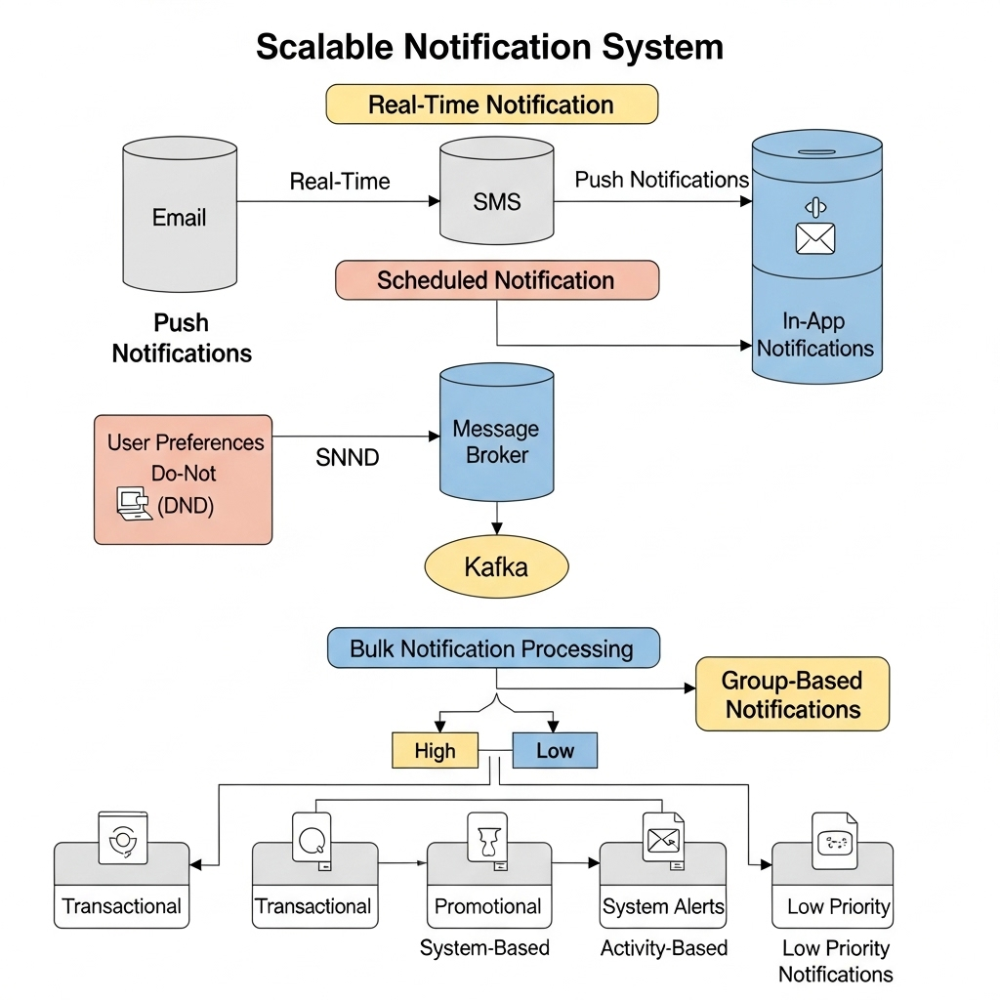

# 1. Notification System Requirements

This document outlines the **functional requirements** for building a **scalable, reliable, and extensible notification system** supporting multiple channels, real-time and scheduled delivery, and user customization.

## Technology Stack
    Golang, PostgreSQL, Redis, Kafka, Firebase Cloud Messaging (FCM)
---

## Functional Requirements

### 1. Multi-Channel Notification Delivery
The system must support multiple delivery channels:
- **Email**
- **SMS**
- **Push Notifications** (e.g., Firebase Cloud Messaging (FCM), Apple Push Notification Service (APNs))
- **In-App Notifications** (displayed inside the application interface)

---

### 2. Real-Time and Scheduled Notifications
- **Immediate Delivery**  
  For critical or transactional events like OTPs, order confirmations, or system alerts.
- **Scheduled Delivery**  
  For bulk or promotional messages, allowing scheduled dispatch at specific times.

---

### 3. User Preferences and Do-Not-Disturb (DND) Settings
- Users can **opt-in or opt-out** of specific notification types.
- Allow configuration of **Do Not Disturb (DND) hours** per user or globally.
- Support **per-channel preferences**, e.g., user may choose **Email only** and disable **SMS**.

---

### 4. Bulk Notification Support
- Handle **large-scale campaigns** efficiently (e.g., marketing broadcasts).
- Support **batching, queuing, and rate-limiting** to optimize performance.
- Scale horizontally with distributed **message brokers** (e.g., Kafka, RabbitMQ).

---

### 5. Group-Based Notification Support
- Define and manage **user groups** (e.g., Premium Users, Merchants).
- Target notifications to **specific roles, segments, or departments**.

---

### 6. Notification Type Support
- **Transactional**: OTPs, order confirmations, password resets.
- **Promotional**: Offers, discounts, marketing campaigns.
- **System Alerts**: Downtime notices, maintenance updates, policy announcements.
- **Activity-Based**: Social updates (e.g., "New follower", "Like on your post").

---

### 7. Priority-Based Delivery
- **High Priority**: Critical notifications (e.g., OTP, fraud alerts) delivered immediately.
- **Low Priority**: Non-critical notifications (e.g., marketing) queued and delivered during off-peak times or per schedule.

---

# Requirement Diagram

